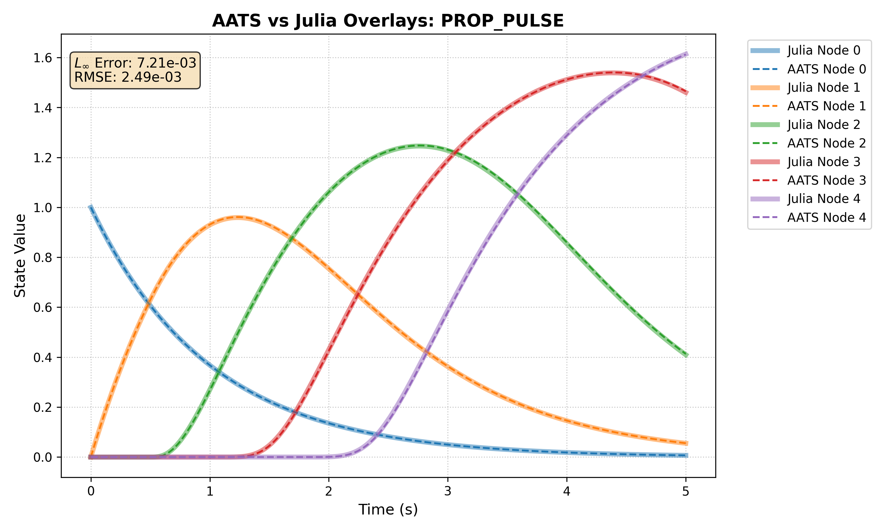
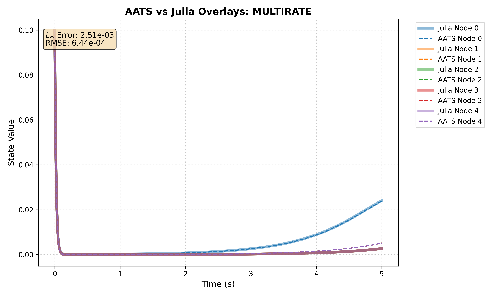
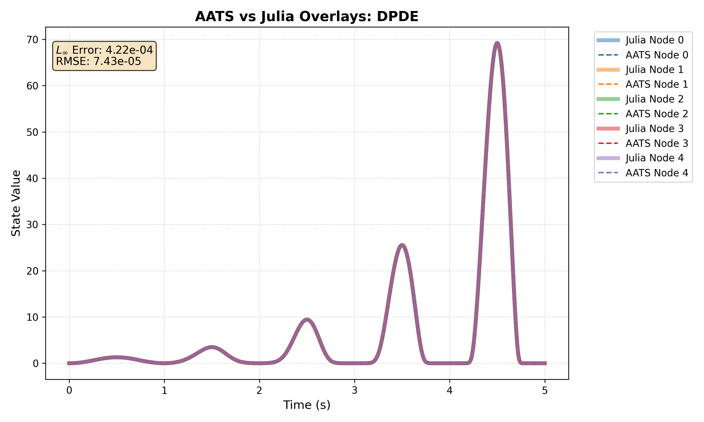
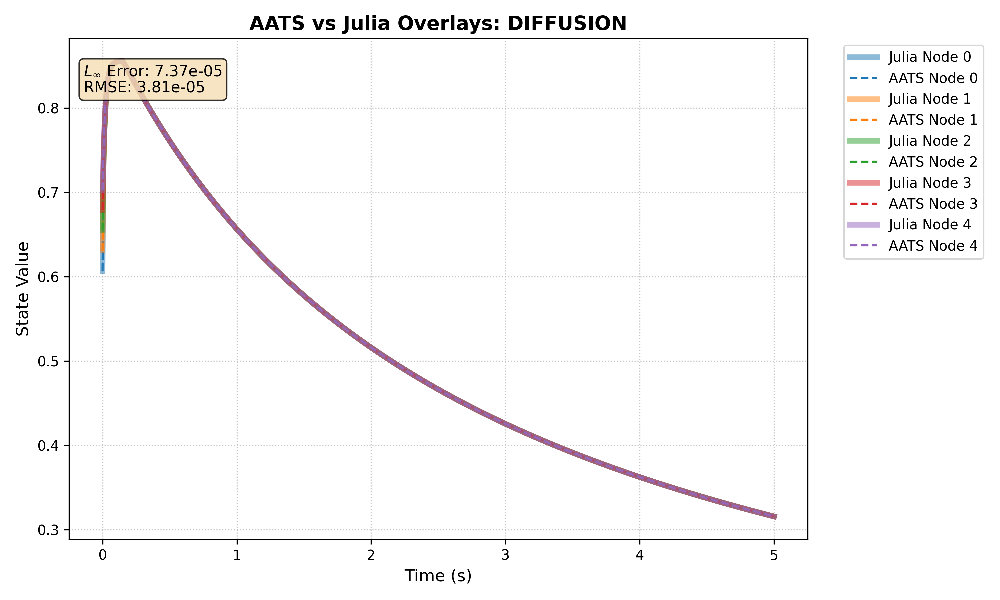

# AATS: Asynchronous Adaptive Taylor Solver for DDEs

[](https://opensource.org/licenses/MIT)
[](https://github.com/amal029)

## Overview
The **Asynchronous Adaptive Taylor Solver (AATS)** is a
high-performance, header-only C++ library designed for integrating
large-scale, strongly coupled, and sparse Delay Differential Equations
(DDEs). Traditional synchronous solvers (like Runge-Kutta) struggle with
multi-rate DDE networks: fast-changing variables force microscopic time
steps globally, and dense-output history buffers require massive memory
allocations. AATS solves this by advancing each variable asynchronously
on its own local time axis. By combining continuous high-order Taylor
polynomials, stack-allocated Automatic Differentiation (AD), and a
predictive wake-up dependency graph, AATS efficiently skips inactive
variables and avoids dynamic memory allocation entirely, yielding near
order-of-magnitude speedups over state-of-the-art synchronous solvers.

## Performance: AATS vs. Julia SciML (Tsit5)
We benchmarked AATS against Julia's `DifferentialEquations.jl` (SciML),
the current state-of-the-art for solving DDEs. Both solvers were
evaluated at a strict global/local error tolerance of `1e-10` over 5
seconds of simulation time.

AATS vastly outperforms the synchronous baseline in highly heterogeneous
and multi-rate topologies, while drastically reducing memory allocation
overhead.

| Benchmark Topology | Dimensions | AATS (C++) | Julia SciML | Speedup | Memory / Allocations Notes |
| :--- | :--- | :--- | :--- | :--- | :--- |
| **Propagating Pulse** | $N=10000$ | **0.098 s** | 0.773 s | **~7.8x** | AATS natively skips sleeping variables. |
| **Sparse Multi-Rate** | $N=10000$ | **14.02 s** | 98.43 s | **~7.0x** | AATS isolates fast variables locally. |
| **Advection DPDE** | $N=10000$ | **79.98 s** | 138.99 s | **~1.7x** | Julia allocated **41.8 GB**; AATS allocated virtually zero dynamic memory. |
| **Diffusion DPDE** | $N=50$ | **0.178 s** | 0.350 s | **~2.0x** | AATS remains stable under extreme explicit stiffness. |
| **State-Dependent** | $N=10000$ | 0.720 s | **0.574 s** | ~0.8x | Heavy local dynamic coupling limits asynchronous advantages. |

## Expected Outputs & Accuracy
At `1e-10` tolerances, the AATS solver produces mathematically identical
trajectories to the 5th-order continuous Runge-Kutta method. The
remaining microscopic differences (in the $10^{-4}$ range) represent the
algorithmic noise floor between explicit Taylor expansion and Hermite
interpolation.

### Wave Propagation & Multi-Rate Dynamics
*(Below are sample overlay plots automatically generated by the plotting script)*

<p align="center">


</p>
<p align="center">


</p>

## Folder Structure
```text
├── include/
│   ├── DDEsolverv2_switch.hpp  # Core AATS solver implementation
│   └── radix_heap.h            # Fast priority queue dependency
├── benchmarks/
│   ├── benchmarks_dep.cpp      # C++ execution for the 5 benchmark systems
│   └── benchmarks.jl           # Julia SciML scripts for baseline comparison
├── scripts/
│   └── plotting.py             # Python utility to generate comparison plots
├── results/                    # Generated CSV logs and comparison plots
├── Makefile                    # Build and execution commands
└── README.md


## Reproducibility Instructions:
At the top level of the directory structure do the following in bash/zsh
shell: ``make compile && make run && make julia && make plot``. If you
want to run the whole pipeline you can do in the shell: ``make full_pipeline``.
